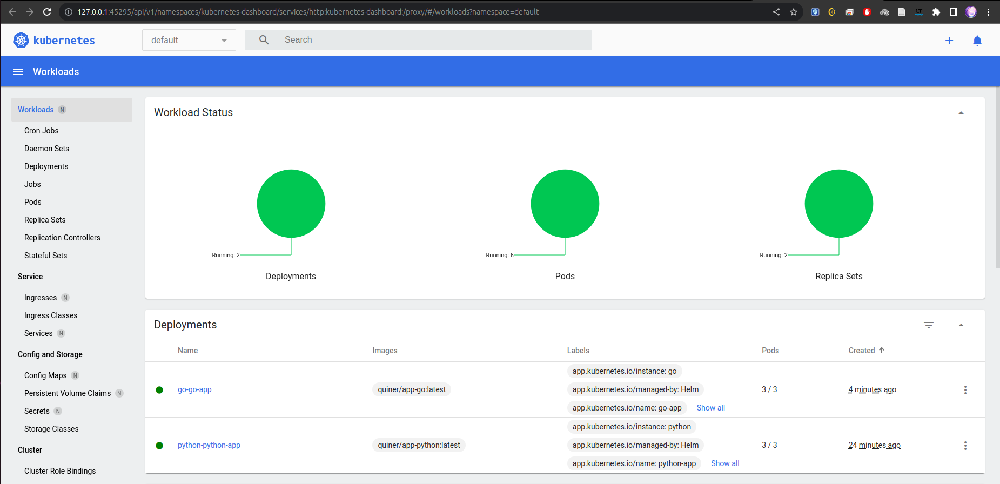

# Helm

## Helm Chart Creation

### Python app

1) Create chart

```shell
helm create app-python
```

Then replace the default repository and tag inside the values.yaml
file with your repository name, update liveness/readiness probe path in
`tepmlates/deployment.yaml`

2) Install chart

```shell
helm install python app-python/ 
```

3) Check service

```shell
quiner@quiner-MaiBook-X-series:~/innopolis/dev-ops-course-labs/k8s/python-app$ kubectl get pods,svc
NAME                                    READY   STATUS    RESTARTS   AGE
pod/python-python-app-f68f8ffb4-hx9kg   1/1     Running   0          14m
pod/python-python-app-f68f8ffb4-lvzf4   1/1     Running   0          14m
pod/python-python-app-f68f8ffb4-s5c88   1/1     Running   0          14m

NAME                        TYPE           CLUSTER-IP      EXTERNAL-IP   PORT(S)          AGE
service/kubernetes          ClusterIP      10.96.0.1       <none>        443/TCP          39m
service/python-python-app   LoadBalancer   10.109.246.80   <pending>     8080:32605/TCP   14m
```

```shell
quiner@quiner-MaiBook-X-series:~/innopolis/dev-ops-course-labs/k8s/python-app$ minikube service python-python-app
|-----------|-------------------|-------------|---------------------------|
| NAMESPACE |       NAME        | TARGET PORT |            URL            |
|-----------|-------------------|-------------|---------------------------|
| default   | python-python-app | http/8080   | http://192.168.49.2:32605 |
|-----------|-------------------|-------------|---------------------------|
🎉  Opening service default/python-python-app in default browser...
```

### Go app

Make the same steps as before

1) Create chart

```shell
helm create go-app
```

2) Install chart

```shell
quiner@quiner-MaiBook-X-series:~/innopolis/dev-ops-course-labs/k8s$ helm install go go-app/
```

3) Check service

```shell
quiner@quiner-MaiBook-X-series:~/innopolis/dev-ops-course-labs/k8s$ kubectl get pods,svc
NAME                                    READY   STATUS    RESTARTS   AGE
pod/go-go-app-6c4cfdb46f-6nthz          1/1     Running   0          23s
pod/go-go-app-6c4cfdb46f-lxjqd          1/1     Running   0          23s
pod/go-go-app-6c4cfdb46f-wj5fx          1/1     Running   0          23s
pod/python-python-app-f68f8ffb4-hx9kg   1/1     Running   0          20m
pod/python-python-app-f68f8ffb4-lvzf4   1/1     Running   0          20m
pod/python-python-app-f68f8ffb4-s5c88   1/1     Running   0          20m

NAME                        TYPE           CLUSTER-IP      EXTERNAL-IP   PORT(S)          AGE
service/go-go-app           LoadBalancer   10.100.81.240   <pending>     8070:30425/TCP   23s
service/kubernetes          ClusterIP      10.96.0.1       <none>        443/TCP          44m
service/python-python-app   LoadBalancer   10.109.246.80   <pending>     8080:32605/TCP   20m
```

```shell
quiner@quiner-MaiBook-X-series:~/innopolis/dev-ops-course-labs/k8s$ minikube service go-go-app
|-----------|-----------|-------------|---------------------------|
| NAMESPACE |   NAME    | TARGET PORT |            URL            |
|-----------|-----------|-------------|---------------------------|
| default   | go-go-app | http/8070   | http://192.168.49.2:30425 |
|-----------|-----------|-------------|---------------------------|
🎉  Opening service default/go-go-app in default browser...
```

### Minikube dashboard



## Helm hooks

### Troubleshoot Hooks

1) Linter

```shell
quiner@quiner-MaiBook-X-series:~/innopolis/dev-ops-course-labs/k8s$ helm lint python-app/
==> Linting python-app/
[INFO] Chart.yaml: icon is recommended

1 chart(s) linted, 0 chart(s) failed
```

2) Install chart and get pods

```shell
quiner@quiner-MaiBook-X-series:~/innopolis/dev-ops-course-labs/k8s$ kubectl get po
NAME                                READY   STATUS      RESTARTS   AGE
postinstall-hook                    0/1     Completed   0          49s
preinstall-hook                     0/1     Completed   0          72s
python-python-app-f68f8ffb4-hstx9   1/1     Running     0          49s
python-python-app-f68f8ffb4-ndmzl   1/1     Running     0          49s
python-python-app-f68f8ffb4-snxvc   1/1     Running     0          49s
```

3) Describe `preinstall_hook`

```shell
quiner@quiner-MaiBook-X-series:~/innopolis/dev-ops-course-labs/k8s$ kubectl describe po preinstall-hook  
Name:             preinstall-hook
Namespace:        default
Priority:         0
Service Account:  default
Node:             minikube/192.168.49.2
Start Time:       Mon, 06 Nov 2023 22:06:07 +0300
Labels:           <none>
Annotations:      helm.sh/hook: pre-install
Status:           Succeeded
IP:               10.244.0.103
IPs:
  IP:  10.244.0.103
Containers:
  pre-install-container:
    Container ID:  docker://bbcc886950444352a193f932fcbf9ffd4d7481eb13d450b2b62fc77aac1c086f
    Image:         busybox
    Image ID:      docker-pullable://busybox@sha256:3fbc632167424a6d997e74f52b878d7cc478225cffac6bc977eedfe51c7f4e79
    Port:          <none>
    Host Port:     <none>
    Command:
      sh
      -c
      echo The pre-install hook is running && sleep 20
    State:          Terminated
      Reason:       Completed
      Exit Code:    0
      Started:      Mon, 06 Nov 2023 22:06:08 +0300
      Finished:     Mon, 06 Nov 2023 22:06:28 +0300
    Ready:          False
    Restart Count:  0
    Environment:    <none>
    Mounts:
      /var/run/secrets/kubernetes.io/serviceaccount from kube-api-access-jflwp (ro)
Conditions:
  Type              Status
  Initialized       True 
  Ready             False 
  ContainersReady   False 
  PodScheduled      True 
Volumes:
  kube-api-access-jflwp:
    Type:                    Projected (a volume that contains injected data from multiple sources)
    TokenExpirationSeconds:  3607
    ConfigMapName:           kube-root-ca.crt
    ConfigMapOptional:       <nil>
    DownwardAPI:             true
QoS Class:                   BestEffort
Node-Selectors:              <none>
Tolerations:                 node.kubernetes.io/not-ready:NoExecute op=Exists for 300s
                             node.kubernetes.io/unreachable:NoExecute op=Exists for 300s
Events:
  Type    Reason     Age    From               Message
  ----    ------     ----   ----               -------
  Normal  Scheduled  3m30s  default-scheduler  Successfully assigned default/preinstall-hook to minikube
  Normal  Pulled     3m29s  kubelet            Container image "busybox" already present on machine
  Normal  Created    3m29s  kubelet            Created container pre-install-container
  Normal  Started    3m29s  kubelet            Started container pre-install-container
```

4) Describe `postinstall_hook`

```shell
quiner@quiner-MaiBook-X-series:~/innopolis/dev-ops-course-labs/k8s$ kubectl describe po postinstall-hook  
Name:             postinstall-hook
Namespace:        default
Priority:         0
Service Account:  default
Node:             minikube/192.168.49.2
Start Time:       Mon, 06 Nov 2023 22:06:30 +0300
Labels:           <none>
Annotations:      helm.sh/hook: post-install
Status:           Succeeded
IP:               10.244.0.105
IPs:
  IP:  10.244.0.105
Containers:
  post-install-container:
    Container ID:  docker://54951dc87b7ae2649df3b58b0617d6e72a6122d7467b71c04fb742c70c646ce8
    Image:         busybox
    Image ID:      docker-pullable://busybox@sha256:3fbc632167424a6d997e74f52b878d7cc478225cffac6bc977eedfe51c7f4e79
    Port:          <none>
    Host Port:     <none>
    Command:
      sh
      -c
      echo The post-install hook is running && sleep 15
    State:          Terminated
      Reason:       Completed
      Exit Code:    0
      Started:      Mon, 06 Nov 2023 22:06:34 +0300
      Finished:     Mon, 06 Nov 2023 22:06:49 +0300
    Ready:          False
    Restart Count:  0
    Environment:    <none>
    Mounts:
      /var/run/secrets/kubernetes.io/serviceaccount from kube-api-access-2q92t (ro)
Conditions:
  Type              Status
  Initialized       True 
  Ready             False 
  ContainersReady   False 
  PodScheduled      True 
Volumes:
  kube-api-access-2q92t:
    Type:                    Projected (a volume that contains injected data from multiple sources)
    TokenExpirationSeconds:  3607
    ConfigMapName:           kube-root-ca.crt
    ConfigMapOptional:       <nil>
    DownwardAPI:             true
QoS Class:                   BestEffort
Node-Selectors:              <none>
Tolerations:                 node.kubernetes.io/not-ready:NoExecute op=Exists for 300s
                             node.kubernetes.io/unreachable:NoExecute op=Exists for 300s
Events:
  Type    Reason     Age   From               Message
  ----    ------     ----  ----               -------
  Normal  Scheduled  4m5s  default-scheduler  Successfully assigned default/postinstall-hook to minikube
  Normal  Pulling    4m5s  kubelet            Pulling image "busybox"
  Normal  Pulled     4m1s  kubelet            Successfully pulled image "busybox" in 1.510386989s (3.794186691s including waiting)
  Normal  Created    4m1s  kubelet            Created container post-install-container
  Normal  Started    4m1s  kubelet            Started container post-install-container
```

5) Hook delete policy

To add hook delete policy, I've included `"helm.sh/hook-delete-policy": hook-succeeded` into hook template files

After helm install, there are no hooks

```shell
quiner@quiner-MaiBook-X-series:~/innopolis/dev-ops-course-labs/k8s$ kubectl get pods,svc
NAME                                    READY   STATUS    RESTARTS   AGE
pod/python-python-app-f68f8ffb4-8jrgw   1/1     Running   0          100s
pod/python-python-app-f68f8ffb4-hrzfc   1/1     Running   0          100s
pod/python-python-app-f68f8ffb4-wxswh   1/1     Running   0          100s

NAME                        TYPE           CLUSTER-IP      EXTERNAL-IP   PORT(S)          AGE
service/kubernetes          ClusterIP      10.96.0.1       <none>        443/TCP          2m10s
service/python-python-app   LoadBalancer   10.111.155.80   <pending>     8080:31367/TCP   100s
```

## Chart library

1) Create library chart

```shell
quiner@quiner-MaiBook-X-series:~/innopolis/dev-ops-course-labs/k8s$ helm dependency update python-app/
Hang tight while we grab the latest from your chart repositories...
...Successfully got an update from the "bitnami" chart repository
Update Complete. ⎈Happy Helming!⎈
Saving 1 charts
Deleting outdated charts
```

```shell
quiner@quiner-MaiBook-X-series:~/innopolis/dev-ops-course-labs/k8s$ helm dependency update go-app/
Hang tight while we grab the latest from your chart repositories...
...Successfully got an update from the "bitnami" chart repository
Update Complete. ⎈Happy Helming!⎈
Saving 1 charts
Deleting outdated charts
```
