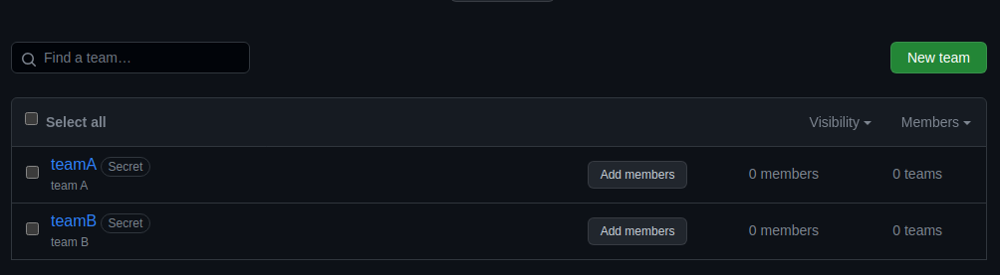

# Terraform

## Terraform best practices

* Separate terraform files by their responsibility: providers, variables, network, outputs, etc.
* Split files by scopes of work (GitHub, Cloud, Docker)
* Preserve one variable naming style (e.g. snake_case)
* Use `terraform fmt` to keep configs consistent
* Use `terraform validate` to keep configs correct

## Docker

### Terraform state list

```shell
quiner@quiner-MaiBook-X-series:~/innopolis/dev-ops-course-labs/terraform$ terraform state list
docker_container.nginx
docker_image.nginx
```

### Terraform state show

```shell
quiner@quiner-MaiBook-X-series:~/innopolis/dev-ops-course-labs/terraform$ terraform state show docker_container.nginx
# docker_container.nginx:
resource "docker_container" "nginx" {
    attach                                      = false
    command                                     = [
        "nginx",
        "-g",
        "daemon off;",
    ]
    container_read_refresh_timeout_milliseconds = 15000
    cpu_shares                                  = 0
    entrypoint                                  = [
        "/docker-entrypoint.sh",
    ]
    env                                         = []
    hostname                                    = "7143d5fe64bd"
    id                                          = "7143d5fe64bd55d171cbda4b30b594dda0bd23940cf0b18a0b36a1f736cb5be2"
    image                                       = "sha256:61395b4c586da2b9b3b7ca903ea6a448e6783dfdd7f768ff2c1a0f3360aaba99"
    init                                        = false
    ipc_mode                                    = "private"
    log_driver                                  = "json-file"
    logs                                        = false
    max_retry_count                             = 0
    memory                                      = 0
    memory_swap                                 = 0
    must_run                                    = true
    name                                        = "NginxContainer"
    network_data                                = [
        {
            gateway                   = "172.17.0.1"
            global_ipv6_address       = ""
            global_ipv6_prefix_length = 0
            ip_address                = "172.17.0.2"
            ip_prefix_length          = 16
            ipv6_gateway              = ""
            mac_address               = "02:42:ac:11:00:02"
            network_name              = "bridge"
        },
    ]
    network_mode                                = "default"
    privileged                                  = false
    publish_all_ports                           = false
    read_only                                   = false
    remove_volumes                              = true
    restart                                     = "no"
    rm                                          = false
    runtime                                     = "runc"
    security_opts                               = []
    shm_size                                    = 64
    start                                       = true
    stdin_open                                  = false
    stop_signal                                 = "SIGQUIT"
    stop_timeout                                = 0
    tty                                         = false
    wait                                        = false
    wait_timeout                                = 60

    ports {
        external = 8080
        internal = 80
        ip       = "0.0.0.0"
        protocol = "tcp"
    }
}
```

### Terraform outputs

```shell
quiner@quiner-MaiBook-X-series:~/innopolis/dev-ops-course-labs/terraform$ terraform output
container_id = "7143d5fe64bd55d171cbda4b30b594dda0bd23940cf0b18a0b36a1f736cb5be2"
image_id = "sha256:61395b4c586da2b9b3b7ca903ea6a448e6783dfdd7f768ff2c1a0f3360aaba99nginx:latest"
```

## VK cloud

### Terraform state list

```shell
quiner@quiner-MaiBook-X-series:~/innopolis/dev-ops-course-labs/terraform/vk-cloud$ terraform state list
data.vkcs_compute_flavor.compute
data.vkcs_images_image.compute
data.vkcs_networking_network.extnet
vkcs_compute_floatingip_associate.fip
vkcs_compute_instance.compute
vkcs_networking_floatingip.fip
vkcs_networking_network.network
vkcs_networking_port.port
vkcs_networking_port_secgroup_associate.port
vkcs_networking_router.router
vkcs_networking_router_interface.db
vkcs_networking_secgroup.secgroup
vkcs_networking_secgroup_rule.secgroup_rule_1
vkcs_networking_secgroup_rule.secgroup_rule_2
vkcs_networking_subnet.subnetwork
```

### Terraform state show

```shell
quiner@quiner-MaiBook-X-series:~/innopolis/dev-ops-course-labs/terraform/vk-cloud$ terraform state show vkcs_compute_instance.compute
# vkcs_compute_instance.compute:
resource "vkcs_compute_instance" "compute" {
    access_ip_v4        = "192.168.199.6"
    all_metadata        = {}
    all_tags            = []
    availability_zone   = "MS1"
    flavor_id           = "25ae869c-be29-4840-8e12-99e046d2dbd4"
    flavor_name         = "Basic-1-2-20"
    force_delete        = false
    id                  = "b0dab35b-4c37-4090-b796-a41a02b09270"
    image_id            = "Attempt to boot from volume - no image supplied"
    key_pair            = "keypair-terraform"
    name                = "compute-instance"
    power_state         = "active"
    region              = "RegionOne"
    security_groups     = [
        "default",
        "security_group",
    ]
    stop_before_destroy = false

    block_device {
        boot_index            = 0
        delete_on_termination = true
        destination_type      = "volume"
        source_type           = "image"
        uuid                  = "b75595ca-4e1d-47e0-8e95-7a02edc0e242"
        volume_size           = 8
        volume_type           = "ceph-ssd"
    }

    network {
        access_network = false
        fixed_ip_v4    = "192.168.199.6"
        mac            = "fa:16:3e:82:5c:60"
        name           = "net"
        uuid           = "e4dbb309-66b5-4071-a09e-3315514445c1"
    }
}
```

### Terraform outputs

```shell
quiner@quiner-MaiBook-X-series:~/innopolis/dev-ops-course-labs/terraform/vk-cloud$ terraform output
instance_fip = "87.239.107.36"
```

## GitHub

### Terraform import

```shell
quiner@quiner-MaiBook-X-series:~/innopolis/dev-ops-course-labs/terraform/github$ terraform import "github_repository.terraform" "devops-terraform"
var.token
  Specifies the GitHub PAT token or `GITHUB_TOKEN`

  Enter a value: 

github_repository.terraform: Importing from ID "devops-terraform"...
github_repository.terraform: Import prepared!
  Prepared github_repository for import
github_repository.terraform: Refreshing state... [id=devops-terraform]

Import successful!

The resources that were imported are shown above. These resources are now in
your Terraform state and will henceforth be managed by Terraform.
```

### GitHub organization

For this task I have created a new [repository](https://github.com/quiner-inno/DevOpsCourse) in GitHub organization to manage teams

### Terraform state list

```shell
quiner@quiner-MaiBook-X-series:~/innopolis/dev-ops-course-labs/terraform/github$ terraform state list
github_branch_default.main
github_branch_protection.default
github_repository.terraform
github_team.teamA
github_team.teamB
github_team_repository.teamA_repo
github_team_repository.teamB_repo
```

### Terraform state show

```shell
quiner@quiner-MaiBook-X-series:~/innopolis/dev-ops-course-labs/terraform/github$ terraform state show github_repository.terraform
# github_repository.terraform:
resource "github_repository" "terraform" {
    allow_auto_merge            = false
    allow_merge_commit          = true
    allow_rebase_merge          = true
    allow_squash_merge          = true
    allow_update_branch         = false
    archived                    = false
    auto_init                   = true
    default_branch              = "main"
    delete_branch_on_merge      = false
    description                 = "DevOps course labs"
    etag                        = "W/\"e8294b8769a001c38ac667614cba0p51232c8376b606bdfe151531c5add895d6\""
    full_name                   = "quiner-inno/DevOpsCourse"
    git_clone_url               = "git://github.com/quiner-inno/DevOpsCourse.git"
    has_discussions             = false
    has_downloads               = false
    has_issues                  = true
    has_projects                = false
    has_wiki                    = true
    html_url                    = "https://github.com/quiner-inno/DevOpsCourse"
    http_clone_url              = "https://github.com/quiner-inno/DevOpsCourse.git"
    id                          = "DevOpsCourse"
    is_template                 = false
    license_template            = "mit"
    merge_commit_message        = "PR_TITLE"
    merge_commit_title          = "MERGE_MESSAGE"
    name                        = "DevOpsCourse"
    node_id                     = "R_kgDOKYqXiw"
    private                     = false
    repo_id                     = 696948619
    squash_merge_commit_message = "COMMIT_MESSAGES"
    squash_merge_commit_title   = "COMMIT_OR_PR_TITLE"
    ssh_clone_url               = "git@github.com:quiner-inno/DevOpsCourse.git"
    svn_url                     = "https://github.com/quiner-inno/DevOpsCourse"
    topics                      = []
    visibility                  = "public"
    vulnerability_alerts        = false

    security_and_analysis {
        secret_scanning {
            status = "disabled"
        }
        secret_scanning_push_protection {
            status = "disabled"
        }
    }
}
quiner@quiner-MaiBook-X-series:~/innopolis/dev-ops-course-labs/terraform/github$ terraform state show github_team_repository.teamA_repo
# github_team_repository.teamA_repo:
resource "github_team_repository" "teamA_repo" {
    etag       = "W/\"d8a7131fc243b50fb93f08ce996bcdc3fad14af1e46e7b22c8221f9344ad0215\""
    id         = "8646221:DevOpsCourse"
    permission = "pull"
    repository = "DevOpsCourse"
    team_id    = "8646221"
}
quiner@quiner-MaiBook-X-series:~/innopolis/dev-ops-course-labs/terraform/github$ terraform state show github_team_repository.teamB_repo
# github_team_repository.teamB_repo:
resource "github_team_repository" "teamB_repo" {
    etag       = "W/\"4f0ade18cde7313e72d5f9755d7cafd347ab44835ced05ba21d6435949737e98\""
    id         = "8646220:DevOpsCourse"
    permission = "admin"
    repository = "DevOpsCourse"
    team_id    = "8646220"
}
```

### Terraform outputs

```shell
quiner@quiner-MaiBook-X-series:~/innopolis/dev-ops-course-labs/terraform/github$ terraform output
team_A_id = "8646221"
team_B_id = "8646220"
```

### GitHub teams with terraform


